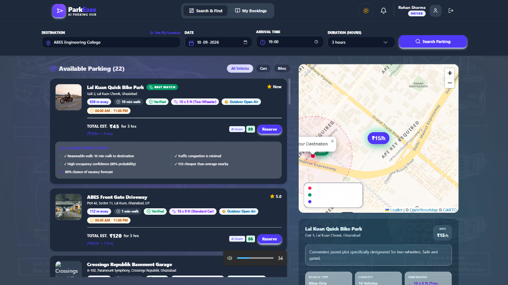
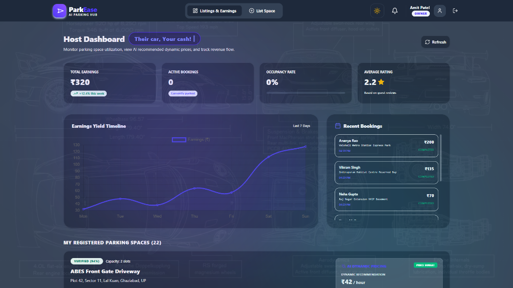
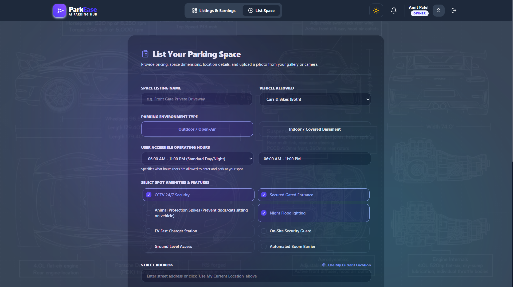
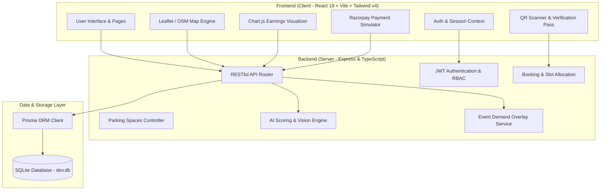

<div align="center">

# 🚗 ParkEase — AI-Powered Smart Parking Hub
### *Transforming Unused Driveways into Guaranteed Parking with Real-Time AI Intelligence*

[](https://react.dev/)
[](https://www.typescriptlang.org/)
[](https://vitejs.dev/)
[](https://tailwindcss.com/)
[](https://nodejs.org/)
[](https://www.prisma.io/)
[](https://www.sqlite.org/)
[](https://ai.google.dev/)
[](https://park-ease-sage.vercel.app)

<br />

[🌐 **Live Demo**](https://park-ease-sage.vercel.app) • [Features](#-key-features) • [Visual Showcase](#-visual-showcase) • [Architecture](#-architecture) • [Demo Credentials](#-instant-demo-credentials) • [Getting Started](#-getting-started) • [Environment Variables](#-environment-variables)

</div>

---

## 📌 Overview

**ParkEase** is an intelligent peer-to-peer parking marketplace designed to eliminate urban parking congestion. Urban commuters waste an average of 20 minutes per trip circling for parking, contributing heavily to fuel waste and carbon emissions. Meanwhile, thousands of private residential and commercial driveways sit empty throughout the day.

ParkEase closes this gap by connecting drivers with space owners in real time through:
- **AI Smart Matching**: Scores and ranks spots using walking distance, traffic levels, and vacancy probability.
- **Dynamic Surge & Event Pricing**: Automatically suggests optimized pricing during local events and peak demand windows.
- **AI Vision Verification**: Analyzes parking photos to verify dimensions, clearances, and authenticate listings before going live.
- **Encrypted QR Terminal Check-In/Out**: Enables automated physical access tracking and live capacity updates.
- **Realistic Razorpay Checkout Simulator**: Complete with UPI, card validation, and payment signature simulation.

---

## 📸 Visual Showcase

### 1. Driver Discovery & AI Smart Match
Drivers search destinations and receive smart recommendations ranked by an AI algorithm factoring in distance, foot-travel time, traffic friction, and vacancy confidence.

<div align="center">
  
</div>

* **Interactive Map & Custom Price Badges**: Real-time Leaflet integration rendering destination radiuses, driving routes, and price pins.
* **AI Scoring Engine (e.g. Score 89/100)**: Displays detailed match reasons (e.g., *10 min walk*, *Minimal traffic congestion*, *80% vacancy forecast*, *₹35 cheaper than average*).
* **Multi-Vehicle Filtering**: One-click toggle between All Vehicles, Cars, and Two-Wheelers.

<br />

### 2. Host Analytics & AI Dynamic Pricing
Property owners can monitor revenue, track real-time parking occupancy, and accept intelligent surge pricing suggestions based on local neighborhood demand.

<div align="center">
  
</div>

* **Revenue & Yield Timeline**: 7-day visual interactive curve powered by Chart.js tracking daily earnings and utilization.
* **Live Occupancy Tracking**: Monitor active parking sessions, guest reviews, and historical bookings.
* **Dynamic Surge Pricing Recommendations**: Heuristics model suggests real-time rate optimizations (e.g., ₹42/hr surge during peak events).

<br />

### 3. Smart Spot Onboarding & Feature Tagging
Hosts list spaces with an intuitive form detailing vehicle permissions, accessibility hours, pricing, and specific security amenities.

<div align="center">
  
</div>

* **Detailed Amenity Configuration**: Tag features including 24/7 CCTV, Gated Access, EV Fast Chargers, Night Floodlighting, and Boom Barriers.
* **Location Geocoding**: Quick address lookup with instant "Use My Current Location" precision GPS pinning.
* **Automated AI Inspection**: Pre-screens uploaded photos for legitimate parking clearances and flags fraudulent listings.

---

## 🚀 Key Features

| Capability | Description |
| :--- | :--- |
| 🧠 **AI Smart Match Algorithm** | Evaluates proximity, walking penalty, live traffic, and historical occupancy to calculate a composite `AI Score` (0-100). |
| 📈 **Dynamic Demand & Surge Pricing** | Detects local events (cricket matches, festivals, exhibitions) and automatically computes optimal rental yields. |
| 🛡️ **AI Vision Photo Verification** | Uses Gemini Vision / heuristic analysis to verify space dimensions, ground clearance, and detect invalid listings. |
| 📱 **QR Gate Check-In & Check-Out** | Live camera-based simulation verifying encrypted passes to transition spots from `RESERVED` to `OCCUPIED` to `COMPLETED`. |
| 💳 **High-Fidelity Razorpay Checkout** | Fully interactive payment drawer simulating UPI IDs, cards, and payment webhooks with animated celebration effects. |
| 🗺️ **Dual-Mode Mapping (Leaflet / Google Maps)** | Smooth OpenStreetMap tiles with Leaflet, with zero-friction fallback if Google Maps API key is omitted. |
| 👥 **Role-Based Workflows** | Built-in tailored experiences for **Drivers** (Search & Book), **Hosts** (List & Earn), and **Admins** (Review Queue & KPI Analytics). |

---

## 🏗️ Architecture



---

## 🔑 Instant Demo Credentials

Skip manual sign-ups using pre-seeded test accounts (Password: **`password123`** for all accounts):

| Role | Email Address | Ideal For Testing |
| :--- | :--- | :--- |
| 🚘 **Driver** | `demo.driver@parkease.com` | Destination search, AI recommendation cards, booking, payment, and QR scan check-in. |
| 🏠 **Owner / Host** | `demo.owner@parkease.com` | Yield timeline, listing spaces, testing AI photo verification, applying smart surge pricing. |
| 🛠️ **Administrator** | `admin@parkease.com` | Platform KPIs, viewing flagged listings, manual approval/rejection moderation queue. |

> [!TIP]
> 🌐 **Experience the Live Web App**: You can try all these flows live without any local setup at **[https://park-ease-sage.vercel.app](https://park-ease-sage.vercel.app)**!

---

## 🛠️ Tech Stack

### Frontend
- **Framework**: [React 19](https://react.dev/) with [Vite](https://vitejs.dev/)
- **Language**: [TypeScript](https://www.typescriptlang.org/)
- **Styling**: [Tailwind CSS v4.0](https://tailwindcss.com/)
- **Maps**: [Leaflet](https://leafletjs.com/) & OpenStreetMap
- **Icons & Visuals**: [Lucide React](https://lucide.dev/), [Canvas Confetti](https://www.npmjs.com/package/canvas-confetti)
- **Charts**: [Chart.js](https://www.chartjs.org/) & [React-ChartJS-2](https://react-chartjs-2.js.org/)

### Backend
- **Runtime**: [Node.js](https://nodejs.org/) & [Express](https://expressjs.com/)
- **Language**: [TypeScript](https://www.typescriptlang.org/) (via `ts-node` & `nodemon`)
- **Authentication**: JWT (`jsonwebtoken`) & `bcryptjs`
- **Database ORM**: [Prisma ORM](https://www.prisma.io/)
- **Database**: [SQLite](https://www.sqlite.org/) (Zero configuration, runs instantly)
- **AI Integration**: Google Gemini API & Heuristic Fallback Engine

---

## ⚙️ Getting Started

### Prerequisites
- **Node.js**: v18.0.0 or higher
- **npm**: v9.0.0 or higher

### 1. Clone the Repository
```bash
git clone https://github.com/ganeshpatel1409/parkease.git
cd parkease
```

### 2. Configure Environment Variables
Copy the pre-configured example file into your local environment:
```bash
cp .env.example .env
```
*(The default `.env` is already configured for zero-setup local execution).*

### 3. Install Dependencies
Run the unified installer script from the root folder:
```bash
npm run install-all
```
*This installs root, backend, and frontend dependencies in a single step.*

### 4. Setup and Seed the Database
Initialize the SQLite database schema and seed demo spots, bookings, and users:
```bash
npm run db:setup
```

### 5. Launch the Application
Start both the Express backend and the Vite client simultaneously:
```bash
npm run dev
```

- **Frontend**: [http://localhost:3000](http://localhost:3000)
- **Backend API**: [http://localhost:5000](http://localhost:5000)

---

## 🔒 Environment Variables

| Variable | Description | Default / Example |
| :--- | :--- | :--- |
| `PORT` | Express backend server port | `5000` |
| `DATABASE_URL` | Prisma SQLite database connection string | `file:./dev.db` |
| `JWT_SECRET` | Secret key used for signing session tokens | `parkease_super_secret_jwt_key_12345` |
| `GOOGLE_MAPS_API_KEY` | *(Optional)* Google Maps key (Leaflet OSM is used automatically if blank) | `""` |
| `RAZORPAY_KEY_ID` | *(Optional)* Razorpay API Key (Simulator used if blank) | `""` |
| `RAZORPAY_KEY_SECRET` | *(Optional)* Razorpay Secret | `""` |
| `AI_API_KEY` | *(Optional)* Google Gemini API Key for Vision & dynamic pricing heuristics | `""` |

---

## 🗺️ Project Structure

```text
parkease/
├── assets/
│   └── screenshots/              # README screenshots & showcase assets
│       ├── driver-search.png
│       ├── host-dashboard.png
│       └── list-space.png
├── client/                       # React 19 Frontend (Vite + Tailwind v4)
│   ├── public/                   # Static assets & icons
│   ├── src/
│   │   ├── components/           # Map, QR Scanner, Navbar, Payment Drawer
│   │   ├── context/              # Global Authentication Context
│   │   ├── pages/
│   │   │   ├── admin/            # Admin moderation & metrics
│   │   │   ├── driver/           # Driver search & booking histories
│   │   │   ├── owner/            # Space listing & host revenue dashboard
│   │   │   ├── LandingPage.tsx   # Public homepage
│   │   │   └── LoginPage.tsx     # One-click quick login
│   │   ├── App.tsx
│   │   └── main.tsx
│   └── package.json
├── server/                       # Node.js + Express TypeScript Backend
│   ├── prisma/
│   │   ├── schema.prisma         # Database models & relationships
│   │   └── seed.ts               # Pre-seeded users, spots, and events
│   ├── src/
│   │   ├── controllers/          # Business logic handlers
│   │   ├── middleware/           # JWT auth & error handling
│   │   ├── services/             # AI heuristics, DB helpers, payment simulation
│   │   ├── routes.ts             # API endpoints
│   │   └── index.ts              # Server entry point
│   └── package.json
├── .env.example                  # Environment configuration template
├── .gitignore                    # Git ignore file (excludes secrets & node_modules)
├── package.json                  # Root runner scripts (concurrently)
└── README.md                     # Project documentation
```

---

## 🤝 Contributing

Contributions make the open-source community an incredible place to learn, inspire, and create. Any contributions you make are **greatly appreciated**!

1. Fork the Project
2. Create your Feature Branch (`git checkout -b feature/AmazingFeature`)
3. Commit your Changes (`git commit -m 'Add some AmazingFeature'`)
4. Push to the Branch (`git push origin feature/AmazingFeature`)
5. Open a Pull Request

---

## 📄 License

Distributed under the **MIT License**. See `LICENSE` for more information.

---

<div align="center">
  <sub>Built with ❤️ by <b>Ganesh Patel</b> & the ParkEase Team</sub>
</div>